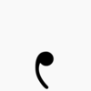
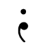
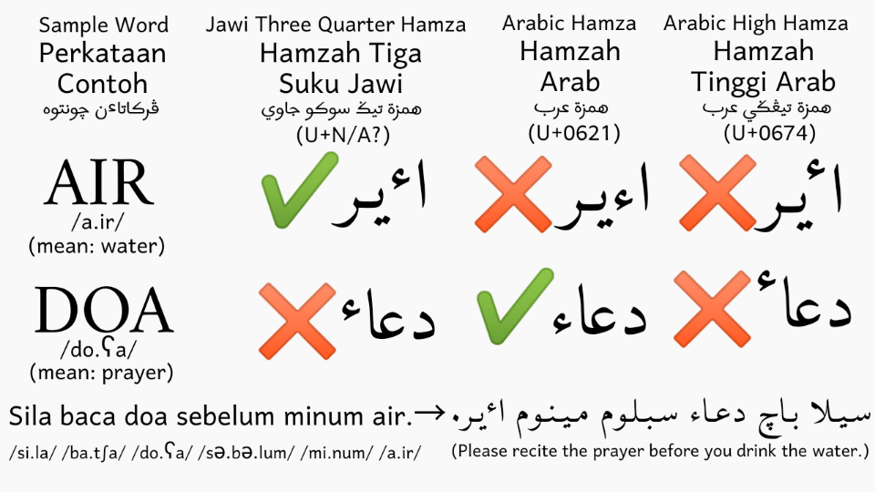
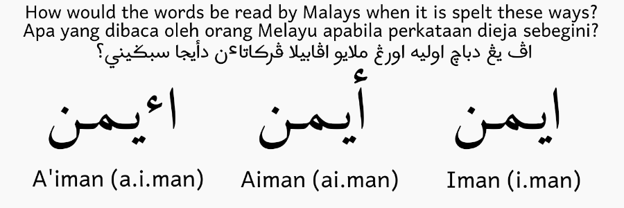

[English](README.md) ∷ [Bahasa Melayu Rumi](README_ms.md) ∷ [بهاس ملايو جاوي](README_ms-Arab.md)

# Jawi Font

Edited version of Arabic font files to add support for Jawi alphabets.

## What is this repository?

This repository contains the original release files of selected open-source Arabic fonts, the FontForge files of edited Arabic fonts, and the released packages of the edited Arabic fonts with support for [Jawi alphabet](https://en.wikipedia.org/wiki/Jawi_alphabet).

## Why did you edit the font files?

There is a limited number of open-source Arabic fonts, and out of those, only small amount of them actually support Jawi alphabet.

The fonts released from this repository will have full support for Jawi alphabet and they will also be usable in older applications where usage of styling sets (ss01 etc) are not possible.

## When was this repository created?

The repository was created on 30 May 2020 (UTF+8).

## Where are the font editing being done?

The fonts are edited on FontForge running on Ubuntu instance via UserLAnd app on my phone. I don't currently have access to any desktop device and will never have any desktop device unless I get accepted for job to earn enough money to build a desktop.

Technical details:

- FontForge version: 11:12 UTC 24-Sep-2017 (latest version available on APT as of 30 May 2020)
- Ubuntu version: Ubuntu 18.04.4 LTS aarch64 (default installation of Ubuntu on UserLAnd)
- UserLAnd version: UserLAnd 2.7.2 (latest version available on my Play store as of 30 May 2020)
- Android version: 8.0.0 (latest version available for this phone as of 30 May 2020)
- Phone model: Samsung Galaxy S7 Edge (SM-G935F), handed to me from my aunt in December 2019 (before that, I've been using Sony Xperia C5 Ultra Dual from 2014, it finally ended its life in March 2020, unable to boot anymore)

## Who maintain these edited fonts?

The owner of the repository, [Yaya MNH48](https://meta.mnh48.moe), acting as the sole owner of the organization jawi-mnh48.

## Why not use the original tools for fonts that has its source available?

I do not have any device that could run them. If any of the fonts in the repository actually have source that is editable natively on FontForge then I would already use it. Most of the fonts I saw uses a paid software known as Glyph, not only does the software very expensive, but it also not available on arm64 Linux.

## How the fonts are edited?

By following the steps in the tutorial titled "[Adding Glyphs to an Arabic Font](http://designwithfontforge.com/en-US/Adding_Glyphs_to_an_Arabic_Font.html)" on the website [Design With FontForge](http://designwithfontforge.com/).

The glyphs that I edit to make it support Jawi alphabet:

- Changing Arabic comma (،) at U+060C to Jawi comma.
  - Majority of digital users of Jawi alphabet uses U+060C for comma as it is what most keyboard have even though it is not actual character for Jawi comma, which doesn't exist in Unicode.
  - On some program and font, Jawi comma is displayed in place of Arabic comma when the program tells the font about the language used in the specified text being Malay, but not all programs or fonts supported this.
    - Known supported fonts are Calibri and Amiri.
    - Known supported programs are Microsoft Office and LibreOffice 6.1+, with limited support in GIMP.
  - In real life handwriting, all Jawi users write the comma the correct way, which is different from Arabic comma.
  - The edited font reversed this, so default would be Jawi comma, and Arabic comma will be displayed instead only if language is Arabic. This makes it display Jawi comma by default when no language is specified, useful for older programs to display Jawi.
  - Jawi comma looked like this:   .
- Point glyph of Reversed comma (⹁) at U+2E41 to Arabic comma U+060C after the change of glyph from Arabic comma to Jawi comma.
  - Some minority people used U+2E41 for comma as it looked more similar to Jawi comma compared to U+060C, but the character being outside Arabic block made some programs broke.
- Changing Arabic semicolon (؛) at U+061B to Jawi semicolon.
  - Majority of digital users of Jawi alphabet uses U+061B for semicolon as it is what most keyboard have even though it is not actual character for Jawi semicolon, which doesn't exist in Unicode.
  - On some program and font, Jawi semicolon is displayed in place of Arabic semicolon when the program tells the font about the language used in the specified text being Malay, but not all programs or fonts supported this.
    - Known supported fonts are Calibri and Amiri.
    - Known supported programs are Microsoft Office and LibreOffice 6.1+, with limited support in GIMP.
  - In real life handwriting, all Jawi users write the semicolon the correct way, which is different from Arabic semicolon.
  - The edited font reversed this, so default would be Jawi semicolon, and Arabic semicolon will be displayed instead only if language is Arabic. This makes it display Jawi semicolon by default when no language is specified, useful for older programs to display Jawi.
  - Jawi semicolon looked like this:   .
- Point glyph of Reversed semicolon (⁏) at U+204F to Arabic semicolon U+061B after the change of glyph from Arabic semicolon to Jawi semicolon.
  - Some minority people used U+204F for semicolon as it looked more similar to Jawi semicolon compared to U+061B, but the character being outside Arabic block made some programs broke.
- Add glyph for Jawi letter NGA (ڠ) at U+06A0, known in Unicode as Arabic Letter Ain with Three Dots Above, used in Malay for the sound /ŋ/.
- Add glyph for Jawi letter GA (ݢ) at U+0762, known in Unicode as Arabic Letter Keheh with Dot Above, used in Malay for the sound /g/.
- Add glyph for Jawi letter VA (ۏ) at U+06CF, known in Unicode as Arabic Letter Waw with Dot Above, used in Malay for the sound /v/.
- Add glyph for Jawi letter NYA (ڽ) at U+06BD, known in Unicode as Arabic Letter Noon with Three Dots Above, used in Malay for the sound /ɲ/.
- Changing the glyph for Arabic hamza (ء) at U+0621 to Jawi letter three quarter hamzah.
  - Majority of digital users of Jawi alphabet uses U+0621 for three quarter hamzah as it is what most keyboard have even though it is not actual character for Jawi letter three quarter hamzah, which doesn't exist in Unicode.
  - The three quarter positioning is sometimes emulated by putting U+0621 in superscript, but that only work in program that support superscripting non-superscript letters. The position is sometimes higher than expected and appears smaller in size when superscripted, which is different from what we actually use in Malay.
  - Jawi three quarter hamzah is not supported in any known fonts. 
  - In real life handwriting, all Jawi users write the three quarter hamzah the correct way, which is different from Arabic hamza.
  - The edited font make Jawi letter three quarter hamzah displayed by default in place of Arabic hamza, and Arabic hamza will be displayed instead only if language is Arabic. This makes it display Jawi three quarter hamzah by default when no language is specified, useful for older programs to display Jawi.
  - Jawi three quarter hamzah looked like this: .
- Point glyph of Arabic high hamza (ٴ) at U+0674 to Arabic hamza U+0621 after the change of glyph from Arabic hamza to Jawi three quarter hamzah.
  - Some minority people used U+0674 for three quarter high hamza as it looked more similar to Jawi hamzah compared to U+0621, but the character is supposed to be part of diphtong and positioned with another vowel in other languages, unlike in Jawi where three quarter hamzah is a standalone letter.
- Add glyph for Jawi old letter GA (ڬ) at U+06AC, known in Unicode as Arabic Letter Kaf with Dot Above, formerly used in Malay for the sound /g/ when Arabic Letter Keheh with Dot Above (ݢ) at U+0762 was not accessible on keyboard.
  - Glyph is for compatibility purposes.
  - In real life handwriting, ڬ was never used in old writing, and it is not used unless for stylistic choice in new writing or used by mistake by people who learnt Jawi using digital tools created in those time when ݢ is not accessible on keyboard, it should always be ݢ in actual writing.
  - ڬ is not formally recognized as a letter in Malay.

Some Arabic fonts had even less glyph coverage and those need more works to do including:

- Add glyph for Jawi letter CA (چ) at U+0686, known in Unicode as Arabic Letter Tcheh, used in Malay for the sound /t͡ʃ/.
- Add glyph for Jawi letter PA (ڤ) at U+06A4, known in Unicode as Arabic Letter Veh, used in Malay for the sound /p/.
- Add glyph for Jawi letter KAF (ک) at U+06A9, known in Unicode as Arabic Letter Keheh, used in Malay for the sound /k/.
- Add glyph for Jawi letter YE (ى) at U+0649, known in Unicode as Arabic Letter Alef Maksura, used in Malay for the final sound /ə/.
- Add glyph for Jawi letter ALIF WITH HAMZAH (أ) at U+0623, known in Unicode as Arabic Letter Alef with Hamza Above, used as a part of diphtongs that can't be used with standalone three quarter hamzah nor without any hamzah. Example: أيمن (aiman) is different from اءيمن (a'iman) and ايمن (iman).
  - See image version below   

For compatibility reason, a few more glyphs will also be checked and added if they don't exist:

- Add glyph for non-Jawi letter known in Unicode as Arabic Letter Yeh with Hamza Above (ئ) at U+0626.
  - Glyph added for compatibility reason.
  - This was used in old Jawi as the diphtongs /ai/ and /ae/ (both are now written as أي), and the sound /iʔ/ and /eʔ/ (both are now written as يء).
  - Still in used as part of the Malay family name Nik (نئ) such as [Nik Abdul Aziz](https://en.wikipedia.org/wiki/Nik_Abdul_Aziz_Nik_Mat) (نئ عبدالعزيز).
- Add glyph for non-Jawi letter known in Unicode as Arabic Letter Waw with Hamza Above (ؤ) at U+0624.
  - Glyph added for compatibility reason.
  - This was used in old Jawi as the diphtongs /ao/ and /au/ (both are now written as أو) and the sounds /uʔ/ and /oʔ/ (both are now written as وء).
- Add glyph for non-Jawi letter known in Unicode as Arabic Letter Dul (ڎ) at U+068E.
  - Glyph added for compatibility reason.
  - This was used in some area to spell Sundanese and Javanese words in Malay.
  - Spelt as DH in Rumi, sound like /ɖʱ/.
  - Currently in use in Pegon script in Indonesia, Pegon script is based on Jawi.
- Add glyph for non-Jawi letter known in Unicode as Arabic Letter Tah with Three Dots Above (ڟ) at U+069F.
  - Glyph added for compatibility reason.
  - This was used in some area to spell Sundanese and Javanese words in Malay.
  - Spelt as TH in Rumi, sound like /tʰ/.
  - Currently in use in Pegon script in Indonesia, Pegon script is based on Jawi.

All other letters should already exist in common Arabic fonts, including one deprecated letter:
- Jawi letter OLD KAF (ك) at U+0643, known in Unicode as Arabic Letter Kaf, formerly used in Malay for the sound /k/ when Arabic Letter Keheh (ک) at U+06A9 was not accessible on keyboard.
  - Glyph is for compatibility purposes.
  - In real life handwriting, ك was never used in old writing, and it is not used unless for stylistic choice in new writing or used by mistake by people who learnt Jawi using digital tools created in those time when ک is not accessible on keyboard, it should always be ک in actual writing.
  - ك is not formally recognized as a letter in Malay.
  - ك is called as Arabic Kaf by Malays, as opposed to just Kaf, because Kaf in Malay is ک.

