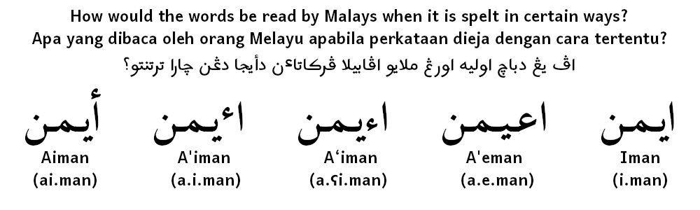

[English](README.md) ∷ [Bahasa Melayu Rumi](README_ms.md) ∷ [بهاس ملايو جاوي](README_ms-Arab.md)

# Jawi Font (Fon Jawi)

Fail-fail fon tulisan Arab yang disunting untuk menambah sokongan huruf-huruf Jawi.

## Apakah kegunaan repositori ini?

Repositori ini mempunyai fail-fail terbitan asal bagi beberapa fon tulisan Arab bersumber terbuka yang terpilih, fail-fail FontForge untuk fon Arab yang telah disunting, dan juga pakej fon Arab tersunting yang diterbitkan yang mengandungi sokongan [tulisan Jawi](https://ms.wikipedia.org/wiki/Tulisan_Jawi).

## Kenapa sunting fail-fail fon?

Jumlah fon Arab bersumber terbuka adalah sedikit, dan daripada situ pun, hanya sebilangan kecil sahaja yang sebenarnya menyokong tulisan Jawi.

Fon-fon yang diterbitkan daripada repositori ini akan mempunyai sokongan penuh untuk tulisan Jawi dan ia juga akan mampu digunakan pada aplikasi-aplikasi lama di mana kegunaan set penggayaan fon (*stylistic sets*, seperti ss01 dll) tidak dapat digunakan.

## Bilakah repositori ini dicipta?

Repositori ini dicipta pada 30 Mei 2020 (tarikh Malaysia).

## Di manakah suntingan fon dilakukan?

Sesetengah fon disunting menggunakan FontForge yang dijalankan pada tika Ubuntu melalui aplikasi UserLAnd dekat telefon saya. Fon lebih baharu pula disunting menggunakan FontForge di komputer yang menjalankan sama ada sistem pengoperasian Ubuntu 20.04 LTS ataupun Windows 10 20H2.

Maklumat teknikal lama:

- Versi FontForge: 11:12 UTC 24-Sep-2017 (versi terbaru yang ada di APT setakat 30 Mei 2020)
- Versi Ubuntu: Ubuntu 18.04.4 LTS aarch64 (pemasangan asal Ubuntu di UserLAnd)
- Versi UserLAnd: UserLAnd 2.7.2 (versi terbaru yang ada di Play store saya setakat 30 Mei 2020)
- Versi Android: 8.0.0 (versi terbaru yang ada untuk telefon ini setakat 30 Mei 2020)
- Model telefon: Samsung Galaxy S7 Edge (SM-G935F), diberikan oleh maksu saya pada bulan Disember 2019 (sebelum itu, saya gunakan Sony Xperia C5 Ultra Dual sejak tahun 2014, ia telah tamat riwayat pada Mac 2020, tidak mampu but sudah.)

Maklumat teknikal baharu:

- Versi FontForge: 20201107 (2020-11-07 21:17 UTC-ML-TtfDb-D-GDK3)
- Sistem pengoperasian 1: Ubuntu 20.04 LTS amd64
- Sistem pengoperasian 2: Windows 10 20H2 (19042.685)
- Unit pemprosesan pusat: Intel® Core™ i5-4570 CPU @ 3.20GHz
- Ingatan: 8.0 GB DDR3 1600 MHz DIMM
- Unit pemprosesan grafik: Intel® HD Graphics 4600
- Perkakasan internet 1: Realtek RTL8192EE Wireless LAN 802.11n PCI-E NIC
- Sambungan internet: Maxis Hotlink Prepaid Unlimited
- Langganan internet: Unlimited internet and calls (6Mbps) 30-day @ RM 45.00 + Hotspot @ RM 5.00 (diperbaharui setiap setengah bulan kerana kuota kegunaan saksama 50GB akan habis pada pertengahan bulan)

## Siapa yang menyenggara kesemua fon-fon yang telah disunting ini?

Pemilik repositori, [Yaya MNH48](https://meta.mnh48.moe), selaku pemilik tunggal organisasi jawi-mnh48.

## Kenapa tidak gunakan alatan asal untuk fon-fon yang mempunyai sumber tersedia?

Saya tidak mempunyai sebarang peranti yang mampu menjalankan alat tersebut. Sekiranya mana-mana fon dalam repositori yang mempunyai sumber tersedia yang boleh disunting terus secara natif di FontForge maka saya akan sudah tentu gunakannya. Kebanyakan fon yang saya jumpa disunting menggunakan perisian berbayar yang dikenali sebagai Glyph, bukan sahaja ianya sangat mahal, malah ia juga tidak tersedia untuk Linux arm64.

## Bagaimanakah cara fon-fon ini disunting?

Dengan mengikut langkah-langkah dalam tutorial berbahasa Inggeris yang bertajuk "[Adding Glyphs to an Arabic Font](http://designwithfontforge.com/en-US/Adding_Glyphs_to_an_Arabic_Font.html)" (Menambah Glif ke Fon Arab) di laman sesawang [Design With FontForge](http://designwithfontforge.com/) (Merekacipta Menggunakan FontForge).

Glif-glif yang saya sunting untuk membuatnya sokong tulisan Jawi termasuklah:

- Tambah glif untuk Koma Cermin (⹁) di U+2E41, ini ialah koma Jawi.
  - Sebilangan kecil pengguna menggunakan Koma Arab di U+060C atas pelbagai sebab berbeza dan ia tidak akan diubah, jika ingin paparkan koma Jawi maka ubah tulisan supaya menggunakan U+2E41.
- Tambah glif untuk Koma Bertitik Cermin (⁏) di U+204F, ini ialah koma bertitik Jawi.
  - Sebilangan kecil pengguna menggunakan Koma Bertitik Arab di U+061B atas pelbagai sebab berbeza dan ia tidak akan diubah, jika ingin paparkan koma bertitik Jawi maka ubah tulisan supaya menggunakan U+204F.
- Tambah glif untuk huruf Jawi NGA (ڠ) di U+06A0, dikenali dalam Unicode sebagai Arabic Letter Ain with Three Dots Above, digunakan dalam bahasa Melayu untuk bunyi /ŋ/.
- Tambah glif untuk huruf Jawi GA (ݢ) di U+0762, dikenali dalam Unicode sebagai Arabic Letter Keheh with Dot Above, digunakan dalam bahasa Melayu untuk bunyi /g/.
- Tambah glif untuk huruf Jawi VA (ۏ) di U+06CF, dikenali dalam Unicode sebagai Arabic Letter Waw with Dot Above, digunakan dalam bahasa Melayu untuk bunyi /v/.
- Tambah glif untuk huruf Jawi NYA (ڽ) di U+06BD, dikenali dalam Unicode sebagai Arabic Letter Noon with Three Dots Above, digunakan dalam bahasa Melayu untuk bunyi /ɲ/.
- Tambah glif untuk huruf Jawi lama GA (ڬ) di U+06AC, dikenali dalam Unicode sebagai Arabic Letter Kaf with Dot Above, dahulunya digunakan dalam bahasa Melayu untuk bunyi /g/ apabila Arabic Letter Keheh with Dot Above (ݢ) di U+0762 tidak boleh dimasukkan dengan papan kekunci.
  - Glif disertakan untuk kegunaan keserasian
  - Dalam tulisan tangan dunia nyata, ڬ tidak pernah digunakan dalam tulisan lama, dan ia tidak digunakan melainkan untuk tujuan penggayaan dalam penulisan baharu atau tersalahguna oleh orang ramai yang mempelajari Jawi menggunakan alatan digital yang dicipta pada zaman di mana aksara ݢ tidak dapat dimasukkan menggunakan papan kekunci, ia mestilah sentiasa ditulis sebagai ݢ dalam penulisan sebenar.
  - ڬ tidak dikenali secara formalnya sebagai sebuah huruf dalam bahasa Melayu.
- Tambah glif untuk Tilde Jawi (∽) di U+223D, dikenali dalam Unicode sebagai Reversed Tilde, digunakan dalam bahasa Melayu untuk melambangkan bunyi panjang atau bertindak sebagai penanda penggantian.
  - Sebilangan kecil pengguna menggunakan Tilde di U+007E atas pelbagai sebab berbeza dan ia tidak akan diubah, jika ingin paparkan tilde Jawi maka ubah tulisan supaya menggunakan U+223D.

Beberapa jenis hamzah yang berlainan juga ditambah untuk tujuan keserasian, antara yang berkaitan:

- Menukar glif untuk Hamzah Tinggi Arab (ٴ) di U+0674 menjadi hamzah tiga suku.
  - Hamzah tiga suku Jawi tidak wujud dalam Unicode,[[5]](#ref5)[[6]](#ref6)[[8]](#ref8) jadi ini hanyalah penyelesaian sementara waktu.
  - Sesetengah orang menggunakan U+0621 untuk hamzah tiga suku menggantikan hamzah Arab tetapi ianya salah kerana bahasa Melayu menggunakan kedua-duanya dan mengubah hamzah Arab akan menyebabkan ia sukar untuk dikenal.
  - Hamzah tiga suku digunakan dalam perkataan asal dan perkataan serapan dalam bahasa Melayu[[7]](#ref7) manakala hamzah Arab digunakan untuk perkataan yang dipinjam daripada bahasa Arab di dalam bahasa Melayu, kedua-duanya tidak boleh saling bertukar.
 - Hamzah tiga suku Jawi kelihatan sebegini: .
- Kekalkan glif Hamzah Arab di U+0621 kerana ia digunakan untuk perkataan pinjaman bahasa Arab di dalam bahasa Melayu.
- Tambah glif untuk huruf Jawi Alif Berhamzah (أ) di U+0623, dikenali dalam Unicode sebagai Arabic Letter Alef with Hamza Above.
  - Digunakan untuk imbuhan di-, se-, dan ke- dalam bahasa Melayu. Contoh: دأسه (diasah) menggunakan د *di-* (imbuhan ayat pasif) gabung dengan اسه *asah*.[[1]](#ref1)[[2]](#ref2)
  - Digunakan sebagai sebahagian daripada diftong yang tidak boleh digunakan bersama-sama hamzah tiga suku mahupun tanpa sebarang hamzah. Contoh: أيمن (aiman) lain daripada اٴيمن (a'iman), اءيمن (a‘iman), اعيمن (a'eman) dan ايمن (iman).
  - Lihat versi imej di bawah   
- Tambah glif untuk huruf bukan Jawi yang dikenali dalam Unicode sebagai Arabic Letter Alef with Hamza Below di U+0625.
  - Digunakan dalam perkataan pinjaman bahasa Arab di dalam bahasa Melayu. Contoh: وإما (waimma).[[1]](#ref1)[[3]](#ref3)
- Tambah glif untuk huruf bukan Jawi dikenali dalam Unicode sebagai Arabic Letter Yeh with Hamza Above (ئ) di U+0626.
  - Digunakan dalam perkataan pinjaman bahasa Arab di dalam bahasa Melayu. Contoh: ملائکة (malaikat)[[1]](#ref1)[[4]](#ref4).
  - Kebetulannya, ia pernah digunakan dalam Jawi lama sebagai diftong /ai/ dan /ae/ (kedua-duanya kini ditulis sebagai أي atau اٴي), dan bunyi /iʔ/ dan /eʔ/ (kedua-duanya kini ditulis sebagai يٴ).
  - Masih digunakan sebagai sebahagian daripada nama keluarga Melayu iaitu Nik (نئ) seperti [Nik Abdul Aziz](https://ms.wikipedia.org/wiki/Nik_Abdul_Aziz_bin_Nik_Mat) (نئ عبدالعزيز).

Sesetengah fon-fon Arab mempunyai liputan glif yang kurang dan lebih banyak kerja perlu dibuat termasuklah:

- Tambah glif untuk huruf Jawi CA (چ) di U+0686, dikenali dalam Unicode sebagai Arabic Letter Tcheh, digunakan dalam bahasa Melayu untuk bunyi /t͡ʃ/.
- Tambah glif untuk huruf Jawi PA (ڤ) di U+06A4, dikenali dalam Unicode sebagai Arabic Letter Veh, digunakan dalam bahasa Melayu untuk bunyi /p/.
- Tambah glif untuk huruf Jawi KAF (ک) di U+06A9, dikenali dalam Unicode sebagai Arabic Letter Keheh, digunakan dalam bahasa Melayu untuk bunyi /k/.
- Tambah glif untuk huruf Jawi YE (ى) di U+0649, dikenali dalam Unicode sebagai Arabic Letter Alef Maksura, digunakan dalam bahasa Melayu untuk bunyi akhiran /ə/.
- Tambah glif untuk Tanda Petik Pembuka Jawi (‟) di U+201F, dikenali dalam Unicode sebagai Double High-Reversed-9 Quotation Mark.
- Tambah glif untuk Tanda Petik Penutup Jawi (”) di U+201D, dikenali dalam Unicode sebagai Right Double Quotation Mark.
- Tambah glif untuk Koma Atas Terbalik Jawi (‛) di U+201B, dikenali dalam Unicode sebagai Single High-Reversed-9 Quotation Mark.
- Tambah glif untuk Koma Atas Jawi (’) di U+2019, dikenali dalam Unicode sebagai Right Single Quotation Mark.

Untuk tujuan keserasian, beberapa lagi glif turut akan diperiksa dan ditambah jika tidak wujud:

- Tambah glif untuk huruf bukan Jawi dikenali dalam Unicode sebagai Arabic Letter Waw with Hamza Above (ؤ) di U+0624.
  - Glif ditambah untuk tujuan keserasian.
  - Ia pernah digunakan dalam Jawi lama sebagai diftong /ao/ dan /au/ (kedua-duanya kini ditulis sebagai أو atau اٴو) dan bunyi /uʔ/ dan /oʔ/ (kedua-duanya kini ditulis sebagai وٴ).
- Tambah glif untuk huruf bukan Jawi dikenali dalam Unicode sebagai Arabic Letter Dul (ڎ) di U+068E.
  - Glif ditambah untuk tujuan keserasian.
  - Pernah digunakan di sesetengah kawasan untuk menulis perkataan bahasa Sunda dan bahasa Jawa dalam bahasa Melayu.
  - Dieja sebagai DH dalam Rumi, bunyi macam /ɖʱ/.
  - Ketika ini digunakan dalam tulisan Pegon di Indonesia dengan nama Dha, tulisan Pegon diasaskan daripada tulisan Jawi.
- Tambah glif untuk huruf bukan Jawi dikenali dalam Unicode sebagai Arabic Letter Tah with Three Dots Above (ڟ) di U+069F.
  - Glif ditambah untuk tujuan keserasian.
  - Pernah digunakan di sesetengah kawasan untuk menulis perkataan bahasa Sunda dan bahasa Jawa dalam bahasa Melayu.
  - Dieja sebagai TH dalam Rumi, bunyi macam /tʰ/.
  - Ketika ini digunakan dalam tulisan Pegon di Indonesia dengan nama Tha, tulisan Pegon diasaskan daripada tulisan Jawi.
- Tambah glif untuk huruf bukan Jawi dikenali dalam Unicode sebagai Arabic Letter Kaf with Dot Below (ࢴ) di U+08B4.
  - Glif ditambah untuk tujuan keserasian.
  - Pernah digunakan di sesetengah kawasan untuk mengeja perkataan bahasa Sunda dan bahasa Jawa yang mempunyai huruf G dalam bahasa Melayu.
  - Dieja sebagai G dalam Rumi, bunyi macam /g/.
  - Ketika ini digunakan dalam tulisan Pegon di Indonesia dengan nama Gaf, tulisan Pegon diasaskan daripada tulisan Jawi.
  - untuk pengguna Jawi, sila gunakan huruf yang betul iaitu Ga di U+0762 (ݢ) dan bukannya yang ini.

Semua huruf lain sepatutnya sudah wujud dalam fon-fon Arab biasa, termasuk sebuah huruf terkecam:
- Huruf Jawi Lama KAF (ك) di U+0643, dikenali dalam Unicode sebagai Arabic Letter Kaf, dahulunya digunakan dalam bahasa Melayu untuk bunyi /k/ apabila huruf Arabic Letter Keheh (ک) di U+06A9 tidak dapat dimasukkan dengan papan kekunci
  - Glif disertakan untuk kegunaan keserasian
  - Dalam tulisan tangan dunia nyata, ك tidak pernah digunakan dalam tulisan lama, dan ia tidak digunakan melainkan untuk tujuan penggayaan dalan penulisan baharu atau tersalahguna oleh orang ramai yang mempelajari Jawi menggunakan alatan digital yang dicipta pada zaman di mana aksara ک tidak dapat dimasukkan menggunakan papan kekunci, ia mestilah sentiasa ditulis sebagai ک dalam penulisan sebenar.
  - ك tidak dikenali secara formalnya sebagai sebuah huruf dalam bahasa Melayu.
  - ك dipanggil sebagai huruf Kaf Arab oleh orang Melayu, dan bukannya huruf Kaf, kerana huruf Kaf dalam bahasa Melayu hanyalah ک.

Saya juga menambah sokongan untuk tulisan Pegon, periksa jadual terakhir dalam senarai penuh jadual-jadual.

Senarai penuh jadual-jadual boleh dibaca di [sini](https://jawi.mnh48.moe/jawifont/ms/jawitable.html)

## Apakah lesennya?

Kesemua fail fon yang disunting dan fail FontForge yang dijana dilesenkan sama seperti fail fon asal, lihat direktori fon untuk lesen sebenar.

Tema laman sesawang buat sementara waktu ini ialah [Midnight](https://github.com/mattgraham/midnight) oleh [mattgraham](https://twitter.com/mattgraham) yang boleh didapati bawah lesen MIT.

Kesemua kandungan lain dalam repositori ini dan laman sesawang yang dijana daripada repositori ini diterbitkan di bawah lesen MIT.

## Rujukan

1. ↵ Report for Malaysia's Internationalized Domain Name: Jawi Language Issues, ms 13. Diambil daripada http://css.escwa.org.lb/ictd/0960/01.pdf melalui https://www.unescwa.org/events/global-harmonization-arabic-script-use-domain-names-4th-meeting
2. ↵ Daftar Kata Bahasa Melayu - Sebutan Jawi Jilid 1 (A-K), ms 117-118. Dewan Bahasa dan Pustaka.
3. ↵ Daftar Kata Bahasa Melayu - Sebutan Jawi Jilid 2 (L-Z), ms 1551. Dewan Bahasa dan Pustaka.
4. ↵ Daftar Kata Bahasa Melayu - Sebutan Jawi Jilid 2 (L-Z), ms 947. Dewan Bahasa dan Pustaka.
5. ↵ Report for Malaysia's Internationalized Domain Name: Jawi Language Issues, ms 5. Diambil daripada http://css.escwa.org.lb/ictd/0960/01.pdf melalui https://www.unescwa.org/events/global-harmonization-arabic-script-use-domain-names-4th-meeting
6. ↵ Submit Jawi charcter to IANA - final, ms 3. Diambil daripada https://www.iana.org/domains/idn-tables/tables/my_ms-my_1.0.pdf
7. ↵ Daftar Kata Bahasa Melayu - Sebutan Jawi Jilid 1 (A-K), ms 83. Dewan Bahasa dan Pustaka.
8. ↵ Linguistic Diversity in the Internet Root: The Case of the Arabic Script and Jawi. Diambil daripada https://www.icann.org/news/blog/linguistic-diversity-in-the-internet-root-the-case-of-the-arabic-script-and-jawi
